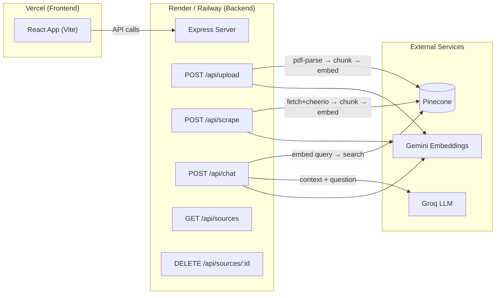

# RAG-Based PDF Query System — Implementation Plan (v3)

Build a production-grade RAG application that lets users upload PDFs, scrape external URLs, and ask natural-language questions answered by an LLM using retrieved context from both sources.

---

## Resolved Questions

| Question | Decision |
|---|---|
| **External sources** | User pastes URLs in the UI → app scrapes + indexes them on demand |
| **Authentication** | No auth — app is public |
| **Chat history & Isolation** | **ChatGPT-style isolated sessions.** Each chat has a unique `chatId`. Uploaded PDFs/URLs are tied to this `chatId` in Pinecone metadata. Queries are filtered by `chatId`. Frontend manages chat history. |
| **Deployment** | Express on **Render/Railway** (traditional server). React frontend on **Vercel**. |

---

## Architecture Overview



### Data Flow

1. **Upload PDF** → `pdf-parse` extracts text **page-by-page** via `pageRender` callback → recursive chunker splits each page into ~1000-char chunks → each chunk tagged with page number → Gemini embeds each chunk → upserted into Pinecone with metadata
2. **Scrape URL** → `fetch` + Readability.js extracts main content → same chunking pipeline → embedding → Pinecone
3. **Ask Question** → Gemini embeds the query → Pinecone returns top-5 similar chunks → chunks + question sent to Groq LLM → structured answer with source citations (e.g. `"Page 3"`, `"https://..."`) returned

---

## Tech Stack Summary

| Layer | Technology | Why |
|---|---|---|
| **Frontend** | React + Vite | Fast dev, familiar stack |
| **Backend** | Express.js (Node.js) | Traditional server, simple routing |
| **Embeddings** | Gemini `gemini-embedding-001` | Free tier, 768 dims, task-type support |
| **Vector DB** | Pinecone (free tier) | Managed, serverless, great JS SDK, free 2GB |
| **LLM** | Groq `llama-3.3-70b-versatile` | Free, no credit card, ultra-fast inference |
| **PDF parsing** | `pdf-parse` (with `pageRender`) | Lightweight, per-page text extraction |
| **Web scraping** | `fetch` + Readability.js + Cheerio | Clean content extraction from any URL |
| **Security** | `helmet` | Security headers in one line |
| **Deploy (FE)** | Vercel | Static site hosting, auto-deploys |
| **Deploy (BE)** | Render / Railway | Traditional Node.js server, free tier |

> [!TIP]
> **Why no LangChain?** Direct SDK calls (Groq, Gemini, Pinecone) keep the code **transparent, debuggable, and interview-friendly** — you can explain every line. LangChain hides the RAG mechanics behind abstractions, which is the opposite of what you want to demonstrate in an evaluation.

> [!NOTE]
> **Repo naming**: The repo is called `rag-langchain` but we're not using LangChain. Consider renaming to `rag-system` or `rag-pdf-query` to avoid confusing the evaluator. If renaming isn't possible, address it in the README: *"Built with direct SDK calls instead of LangChain for transparency and simplicity."*

---

## Project Structure

```
rag-langchain/
├── client/                          # React frontend (Vite)
│   ├── index.html
│   ├── package.json
│   ├── vite.config.js
│   └── src/
│       ├── main.jsx
│       ├── App.jsx
│       ├── index.css
│       └── components/
│           ├── ChatInterface.jsx     # Chat messages + input
│           ├── FileUpload.jsx        # PDF drag-and-drop upload
│           ├── UrlScraper.jsx        # URL input + scrape button
│           ├── SourceList.jsx        # Shows indexed sources
│           └── MessageBubble.jsx     # Single chat message w/ sources
│
├── server/                          # Express backend
│   ├── package.json
│   ├── index.js                     # Server entry point (app.listen)
│   ├── src/
│   │   ├── app.js                   # Express app setup (CORS, helmet, routes)
│   │   ├── routes/
│   │   │   ├── upload.js            # POST /api/upload
│   │   │   ├── scrape.js            # POST /api/scrape
│   │   │   ├── chat.js              # POST /api/chat
│   │   │   └── sources.js           # GET /api/sources, DELETE /api/sources/:id
│   │   ├── services/
│   │   │   ├── pdfService.js        # PDF per-page text extraction + chunking
│   │   │   ├── scraperService.js    # URL scraping + chunking
│   │   │   ├── embeddingService.js  # Gemini embeddings (batched, rate-limited)
│   │   │   ├── vectorService.js     # Pinecone CRUD
│   │   │   ├── llmService.js        # Groq chat completion
│   │   │   └── sourceStore.js       # In-memory source metadata store
│   │   ├── middleware/
│   │   │   └── validateUrl.js       # URL input validation (SSRF protection)
│   │   └── utils/
│   │       ├── chunker.js           # Recursive text splitter
│   │       └── config.js            # Env vars + constants
│   └── .env.example
│
├── .gitignore
├── task.md
└── README.md
```

---

## Proposed Changes

### Phase 1: Backend — Express Server

---

#### [NEW] [package.json](file:///home/dheeraj/internships/brainheaters/rag-langchain/server/package.json)

Dependencies:
| Package | Purpose |
|---|---|
| `express` | HTTP server & routing |
| `cors` | Cross-origin requests (React ↔ Express) |
| `helmet` | Security headers (XSS, content-type sniffing, etc.) |
| `multer` | Multipart file upload (PDF) — memory storage |
| `pdf-parse` | Extract text from PDF buffers (per-page) |
| `cheerio` | Parse/clean HTML from scraped pages |
| `@mozilla/readability` + `jsdom` | Extract main article content from web pages |
| `@google/generative-ai` | Gemini embedding API |
| `@pinecone-database/pinecone` | Vector database client |
| `groq-sdk` | Groq LLM chat completion |
| `dotenv` | Environment variable management |
| `uuid` | Generate unique source/document IDs |

Scripts: `"start": "node index.js"`, `"dev": "node --watch index.js"`

---

#### [NEW] [index.js](file:///home/dheeraj/internships/brainheaters/rag-langchain/server/index.js)

Traditional server entry point:
- Imports the Express app from `src/app.js`
- Calls `app.listen(PORT)` on port 3001 (configurable via env)
- Logs startup message

---

#### [NEW] [config.js](file:///home/dheeraj/internships/brainheaters/rag-langchain/server/src/utils/config.js)

Centralized config reading from environment variables:

| Variable | Default | Description |
|---|---|---|
| `PORT` | `3001` | Server port |
| `GEMINI_API_KEY` | — | Google AI Studio API key |
| `GROQ_API_KEY` | — | Groq console API key |
| `PINECONE_API_KEY` | — | Pinecone API key |
| `PINECONE_INDEX_NAME` | `rag-documents` | Pinecone index name |
| `CHUNK_SIZE` | `1000` | Max characters per chunk |
| `CHUNK_OVERLAP` | `200` | Character overlap between chunks |
| `LLM_MODEL` | `llama-3.3-70b-versatile` | Groq model ID |
| `LLM_MAX_TOKENS` | `1024` | Max tokens for LLM response |
| `EMBEDDING_MODEL` | `gemini-embedding-001` | Gemini embedding model |
| `CLIENT_URL` | `http://localhost:5173` | Frontend URL for CORS |

---

#### [NEW] [chunker.js](file:///home/dheeraj/internships/brainheaters/rag-langchain/server/src/utils/chunker.js)

Custom recursive character text splitter (no LangChain dependency):
- Splits hierarchically: `\n\n` → `\n` → `. ` → ` ` → character-level
- Configurable `chunkSize` (1000) and `chunkOverlap` (200)
- Returns `[{ text, index }]` — metadata (page number, source) gets attached by the calling service
- Simple, readable, easy to explain in an interview

---

#### [NEW] [pdfService.js](file:///home/dheeraj/internships/brainheaters/rag-langchain/server/src/services/pdfService.js)

> [!IMPORTANT]
> Uses `pdf-parse`'s `pageRender` callback to extract text **per page**, not as a single blob. This is critical for mapping chunks back to page numbers (task spec requires `"sources": ["Page 3"]`).

Implementation:
```javascript
// Custom page render function to get text per page
const options = {
  pagerender: function (pageData) {
    return pageData.getTextContent().then(function (textContent) {
      return textContent.items.map(item => item.str).join(' ');
    });
  }
};
```

- `processPdf(buffer, filename)`:
  1. Parses PDF with `pageRender` to get an array of per-page text strings
  2. For each page, runs the chunker
  3. Tags every chunk with `{ source: filename, type: 'pdf', page: pageNumber, chunkIndex }`
  4. Returns flat array of all tagged chunks

---

#### [NEW] [scraperService.js](file:///home/dheeraj/internships/brainheaters/rag-langchain/server/src/services/scraperService.js)

- `scrapeUrl(url)` → fetches HTML, uses `jsdom` + Readability.js to extract main content
- Falls back to Cheerio-based extraction (strip `script`, `style`, `nav`, `footer`) if Readability returns null
- Passes clean text through chunker
- Returns `[{ text, metadata: { source: url, type: 'web', title, chunkIndex } }]`

---

#### [NEW] [embeddingService.js](file:///home/dheeraj/internships/brainheaters/rag-langchain/server/src/services/embeddingService.js)

> [!IMPORTANT]
> **Rate limiting strategy**: Gemini free tier has per-minute limits. The service processes embeddings in **batches of 10 chunks** with a **100ms delay between each API call**. For a 50-chunk PDF, this adds ~5 seconds — acceptable for an upload operation.

- `embedDocuments(texts[])`:
  1. Splits `texts` into groups of 10
  2. For each group, calls Gemini `embedContent` sequentially with 100ms sleep between calls
  3. Uses `taskType: 'RETRIEVAL_DOCUMENT'` for document chunks
  4. Returns array of 768-dimensional vectors
- `embedQuery(query)`:
  - Single call, uses `taskType: 'RETRIEVAL_QUERY'`
  - Returns one 768-dimensional vector

---

#### [MODIFY] [vectorService.js](file:///home/dheeraj/internships/brainheaters/rag-langchain/server/src/services/vectorService.js)

- `upsertChunks(chunks[], embeddings[], sourceId, chatId)` — stores vectors + metadata in Pinecone
  - Metadata now includes: `chatId`, `source`, `type`, `page`, `text`
- `query(embedding, topK=5, chatId)` — cosine similarity search
  - **CRITICAL CHANGE**: Adds Pinecone metadata filter `filter: { chatId: { $eq: chatId } }` so the search only returns vectors belonging to the current chat session.
- `deleteBySource(sourceId)` — unchanged.

---

#### [NEW] [llmService.js](file:///home/dheeraj/internships/brainheaters/rag-langchain/server/src/services/llmService.js)

- `generateAnswer(question, contextChunks[])` → builds a RAG prompt:
  ```
  System: You are a helpful assistant. Answer ONLY using the provided context.
          If the context doesn't contain the answer, say "I don't have enough
          information to answer that." Always cite which sources you used.
  
  Context:
  [1] (source: report.pdf, Page 3) "chunk text..."
  [2] (source: https://en.wikipedia.org/...) "chunk text..."
  
  User: {question}
  ```
- **Temperature: `0`** — factual accuracy, minimal hallucination
- **`max_tokens: 1024`** — caps response length, prevents runaway generation
- Returns `{ answer: string, sources: [{ text, source, type, page? }] }`

---

#### [NEW] [sourceStore.js](file:///home/dheeraj/internships/brainheaters/rag-langchain/server/src/services/sourceStore.js)

> [!NOTE]
> **In-memory source metadata store**. Pinecone doesn't natively support listing distinct sources from its index. This module maintains a `Map<sourceId, metadata>` that tracks all indexed sources. Since there's no database, **this resets on server restart** — but indexed vectors remain in Pinecone. On restart, the source list will be empty until new sources are added. This is documented in the README as a known limitation.

```javascript
// Module-level Map — persists for the lifetime of the server process
const sources = new Map();

export function addSource(sourceId, metadata) { ... }
export function removeSource(sourceId) { ... }
export function getAllSources() { ... }
export function getSource(sourceId) { ... }
```

Stores: `{ id, name, type, url?, chunkCount, createdAt }`

---

#### [NEW] [validateUrl.js](file:///home/dheeraj/internships/brainheaters/rag-langchain/server/src/middleware/validateUrl.js)

> [!WARNING]
> **SSRF protection**: Without validation, a user could submit `file:///etc/passwd`, `http://localhost:3001/api/sources`, or `http://169.254.169.254/...` (cloud metadata endpoint) as a URL to scrape.

Validation rules:
1. Must start with `http://` or `https://` (blocks `file://`, `ftp://`, etc.)
2. Hostname must not resolve to a private IP range (`10.x`, `172.16-31.x`, `192.168.x`, `127.x`, `169.254.x`)
3. Hostname must not be `localhost` or `0.0.0.0`
4. Returns `400` with a descriptive error message on failure

---

#### [NEW] [app.js](file:///home/dheeraj/internships/brainheaters/rag-langchain/server/src/app.js)

Express app factory:
- `helmet()` — security headers (one line, looks professional)
- `cors({ origin: CLIENT_URL })`
- `express.json({ limit: '10mb' })`
- Mounts routes: `/api/upload`, `/api/scrape`, `/api/chat`, `/api/sources`
- Global error handler middleware (catches async errors, returns 500 with message)
- Exports `app` (does NOT call `listen`)

---

#### [MODIFY] [upload.js](file:///home/dheeraj/internships/brainheaters/rag-langchain/server/src/routes/upload.js)
```http
POST /api/upload
Content-Type: multipart/form-data
Body: file (PDF, max 10MB), chatId (string)
Response: { success, sourceId, filename, chunkCount }
```
- Attaches `chatId` from `req.body` to all chunks before upserting.

#### [MODIFY] [scrape.js](file:///home/dheeraj/internships/brainheaters/rag-langchain/server/src/routes/scrape.js)
```http
POST /api/scrape
Body: { "url": "https://...", "chatId": "string" }
```
- Attaches `chatId` from `req.body` to all chunks before upserting.

#### [MODIFY] [chat.js](file:///home/dheeraj/internships/brainheaters/rag-langchain/server/src/routes/chat.js)
```http
POST /api/chat
Body: { "question": "What is RAG?", "chatId": "string" }
```
- Passes `chatId` to `queryVectors()` to filter Pinecone search.

#### [MODIFY] [sourceStore.js](file:///home/dheeraj/internships/brainheaters/rag-langchain/server/src/services/sourceStore.js) & `sources.js` route
- Need to update the store to group sources by `chatId` so the frontend knows which PDFs belong to which chat when it switches sessions.
- `GET /api/sources/:chatId` (returns sources for a specific chat).

---

#### [NEW] [.env.example](file:///home/dheeraj/internships/brainheaters/rag-langchain/server/.env.example)
```env
PORT=3001
GEMINI_API_KEY=your_gemini_api_key
GROQ_API_KEY=your_groq_api_key
PINECONE_API_KEY=your_pinecone_api_key
PINECONE_INDEX_NAME=rag-documents
CLIENT_URL=http://localhost:5173
```

---

### Phase 2: Frontend — React (Vite)

---

#### [NEW] [package.json](file:///home/dheeraj/internships/brainheaters/rag-langchain/client/package.json)

Dependencies: `react`, `react-dom`, `react-markdown`, `remark-gfm`, `react-dropzone`, `lucide-react`

> [!NOTE]
> `remark-gfm` is required as a plugin for `react-markdown` — without it, tables, strikethrough, and task lists from LLM responses won't render properly.

#### [NEW] [vite.config.js](file:///home/dheeraj/internships/brainheaters/rag-langchain/client/vite.config.js)
- Dev proxy: `/api` → `http://localhost:3001` (avoids CORS issues in local dev)

#### [NEW] [index.css](file:///home/dheeraj/internships/brainheaters/rag-langchain/client/src/index.css)
Design system:
- **Dark theme**: deep navy/slate backgrounds (`hsl(222, 47%, 11%)`)
- **Accent**: violet → indigo → cyan gradient
- **Cards**: glassmorphism with `backdrop-filter: blur(12px)`
- **Typography**: Google Font **Inter** (clean, modern)
- **Animations**: smooth fade-ins, pulse loaders, hover lifts
- **Responsive**: sidebar collapses on mobile

#### [NEW] [App.jsx](file:///home/dheeraj/internships/brainheaters/rag-langchain/client/src/App.jsx)
Layout:
- **Left sidebar** (280px): `SourceList` at top, `FileUpload` + `UrlScraper` below
- **Main area**: `ChatInterface` (full height, scrollable)
- Sidebar collapses to a hamburger drawer on screens < 768px
- State management: `useState` for messages, sources, loading states
- API helper functions for all endpoints

#### [NEW] [ChatInterface.jsx](file:///home/dheeraj/internships/brainheaters/rag-langchain/client/src/components/ChatInterface.jsx)
- Scrollable message list with `ref` for auto-scroll-to-bottom
- Text input bar + send button (disabled while loading)
- Typing indicator animation while waiting for LLM response
- Renders `MessageBubble` for each message

#### [NEW] [MessageBubble.jsx](file:///home/dheeraj/internships/brainheaters/rag-langchain/client/src/components/MessageBubble.jsx)
- **User messages**: right-aligned, gradient background
- **AI messages**: left-aligned, glass card
- Renders markdown via `react-markdown` with `remark-gfm` plugin
- Expandable **"Sources used"** section showing PDF pages and/or URLs

#### [NEW] [FileUpload.jsx](file:///home/dheeraj/internships/brainheaters/rag-langchain/client/src/components/FileUpload.jsx)
- `react-dropzone` with dashed border, drag hover animation
- Validates file type (PDF only) and size (max 10MB)
- Upload progress state (uploading → processing → done)
- Calls `POST /api/upload`

#### [NEW] [UrlScraper.jsx](file:///home/dheeraj/internships/brainheaters/rag-langchain/client/src/components/UrlScraper.jsx)
- URL text input + "Add Source" button
- Basic URL validation (must start with `http://` or `https://`)
- Loading spinner while scraping
- Calls `POST /api/scrape`

#### [NEW] [SourceList.jsx](file:///home/dheeraj/internships/brainheaters/rag-langchain/client/src/components/SourceList.jsx)
- Lists all indexed sources fetched from `GET /api/sources`
- PDF icon (📄) vs web icon (🌐) differentiation
- Shows chunk count per source
- Delete button per source → calls `DELETE /api/sources/:id`

---

### Phase 3: Documentation

---

#### [NEW] [README.md](file:///home/dheeraj/internships/brainheaters/rag-langchain/README.md)
Contents:
1. Project overview & architecture diagram
2. Note: *"Built with direct SDK calls for transparency — no LangChain abstractions"*
3. Prerequisites (Node.js 18+, API keys)
4. Getting API keys (Gemini, Groq, Pinecone — step-by-step)
5. Environment variable setup
6. Local development instructions
7. Deployment guide (React → Vercel, Express → Render)
8. API documentation
9. Known limitations (source list resets on server restart)

#### [MODIFY] [.gitignore](file:///home/dheeraj/internships/brainheaters/rag-langchain/.gitignore)
Add `node_modules/`, `dist/`, `.env`, `.env.local`

---

## Build Order

| Step | What | Depends on |
|---|---|---|
| 1 | Server scaffolding (`package.json`, `index.js`, `app.js`, `config.js`) | — |
| 2 | `chunker.js` | — |
| 3 | `sourceStore.js` | — |
| 4 | `embeddingService.js` | config |
| 5 | `vectorService.js` | config |
| 6 | `validateUrl.js` middleware | — |
| 7 | `pdfService.js` + `POST /api/upload` route | chunker, embedding, vector, sourceStore |
| 8 | `scraperService.js` + `POST /api/scrape` route | chunker, embedding, vector, sourceStore, validateUrl |
| 9 | `llmService.js` + `POST /api/chat` route | embedding, vector |
| 10 | `GET /api/sources` + `DELETE /api/sources/:id` | sourceStore, vector |
| 11 | React app scaffolding + design system | — |
| 12 | All React components | — |
| 13 | Integration testing | steps 1–12 |
| 14 | README + deployment | steps 1–13 |

---

## Verification Plan

### Automated Tests
1. Start Express server → upload a small test PDF → verify chunks stored in Pinecone with page number metadata
2. Scrape a known Wikipedia URL → verify text extraction and indexing
3. `POST /api/chat` with a question → verify response matches spec: `{ answer, sources: ["Page 3"] }`
4. `POST /api/scrape` with `file:///etc/passwd` → verify 400 rejection (SSRF protection)
5. `POST /api/scrape` with `http://localhost:3001` → verify 400 rejection
6. `DELETE /api/sources/:id` → verify vectors removed from Pinecone + source removed from store

### Manual Verification
1. Start both dev servers (client `:5173`, server `:3001`)
2. Upload a PDF → appears in source list with chunk count
3. Add a Wikipedia URL → appears in source list
4. Ask a question about the PDF → answer cites specific page numbers
5. Ask a question about the web source → answer cites the URL
6. Delete a source → disappears from list, subsequent queries don't return its content
7. Test responsive design on mobile viewport
8. Deploy: React → Vercel, Express → Render → test cross-origin communication
